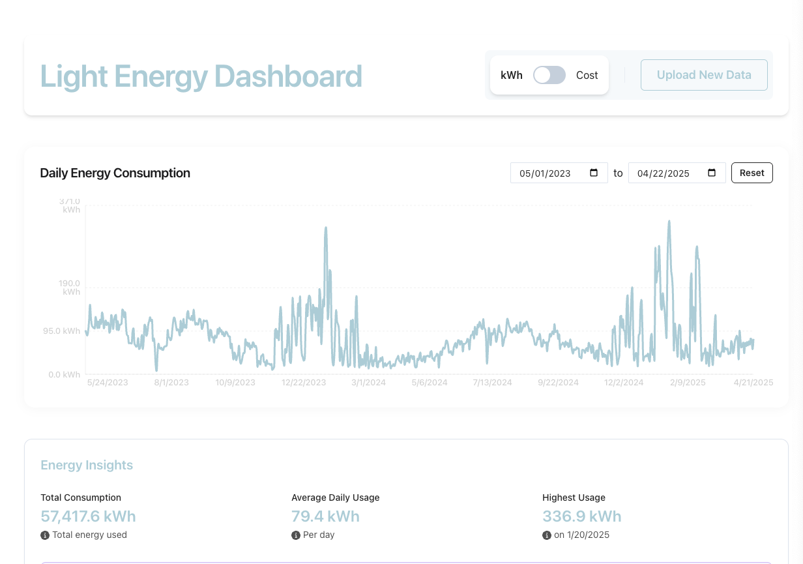

# Light Energy Dashboard

A modern, interactive dashboard for visualizing and understanding residential energy consumption patterns. Built with React, TypeScript, and Chakra UI.



## Features

- 📊 **Interactive Energy Chart**
  - Daily energy consumption visualization
  - Toggle between kWh and cost views
  - Date range selection for focused analysis

- 💡 **Smart Energy Insights**
  - Total consumption/cost over selected period
  - Average daily consumption/cost
  - Highest usage day with date
  - Usage trend analysis (comparing first and last week)
  - Potential savings estimates
  - Interactive tooltips for better understanding

- 🔄 **Data Management**
  - CSV file upload support
  - 15-minute interval data processing
  - Automatic cost calculation (14¢/kWh)
  - Date range filtering
  - Data validation and error handling

## Tech Stack

- React 18
- TypeScript
- Chakra UI for styling
- Recharts for data visualization
- date-fns for date manipulation
- Framer Motion for animations

## Getting Started

### Prerequisites

- Node.js 16.x or later
- npm 7.x or later

### Installation

1. Clone the repository:
   ```bash
   git clone https://github.com/yourusername/light-energy-dashboard.git
   cd light-energy-dashboard
   ```

2. Install dependencies:
   ```bash
   npm install
   ```

3. Start the development server:
   ```bash
   npm run dev
   ```

4. Open [http://localhost:5173](http://localhost:5173) in your browser.

### Building for Production

```bash
npm run build
```

The build artifacts will be stored in the `dist/` directory.

## Usage

1. **Upload Data**
   - Click the upload area or drag and drop your CSV file
   - The file should contain 15-minute interval energy data
   - Supported format: CSV with datetime, duration, unit, consumption, and generation columns

2. **View Dashboard**
   - The chart shows daily energy consumption
   - Use the date range selector to focus on specific periods
   - Toggle between kWh and cost views using the unit toggle
   - Hover over data points for detailed information

3. **Analyze Insights**
   - View total consumption and costs
   - Check average daily usage
   - Identify highest usage days
   - Monitor usage trends
   - Get potential savings estimates

## Data Format

The application expects a CSV file with the following columns:
- `datetime`: Timestamp (YYYY-MM-DD HH:mm:ss)
- `duration`: Duration in minutes
- `unit`: Energy unit (e.g., "Wh")
- `consumption`: Energy consumption value
- `generation`: Energy generation value (if applicable)

## Contributing

1. Fork the repository
2. Create your feature branch (`git checkout -b feature/amazing-feature`)
3. Commit your changes (`git commit -m 'Add some amazing feature'`)
4. Push to the branch (`git push origin feature/amazing-feature`)
5. Open a Pull Request

## License

This project is licensed under the MIT License - see the [LICENSE](LICENSE) file for details.

## Acknowledgments

- [Chakra UI](https://chakra-ui.com/) for the beautiful component library
- [Recharts](https://recharts.org/) for the charting capabilities
- [Framer Motion](https://www.framer.com/motion/) for the smooth animations
